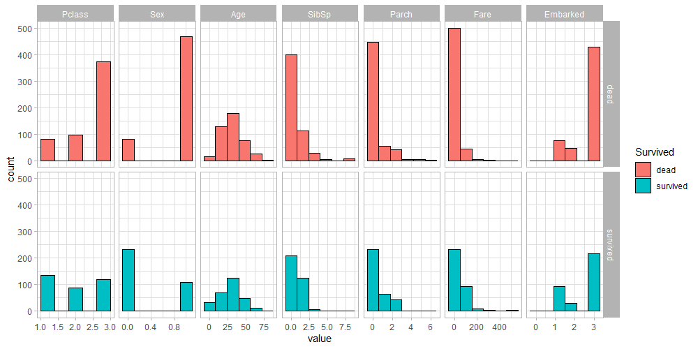

# Variable Analysis

**Objective**: Identify which of the stats are relevant to make a prediction algorithm

#### Fist Idea: Plot a histogram of all the relevant variables to the problem

- You survival rate is inversely proportional to your class
- Being very young would increase your survival rate
- Females have a much higher survival rate
- Having a SibSp count of exactly 2 would increase your survival rate
- A Parch of 2 or 3 would also increase your survival rate
- Higher fares would lead to higher survival rate
- Embarking in Cherbourg could increase your survival rate

Following an assessment of the table, class, fare and location embarked seem to be dependent variables.
Which is what I am planning to analyze next...
